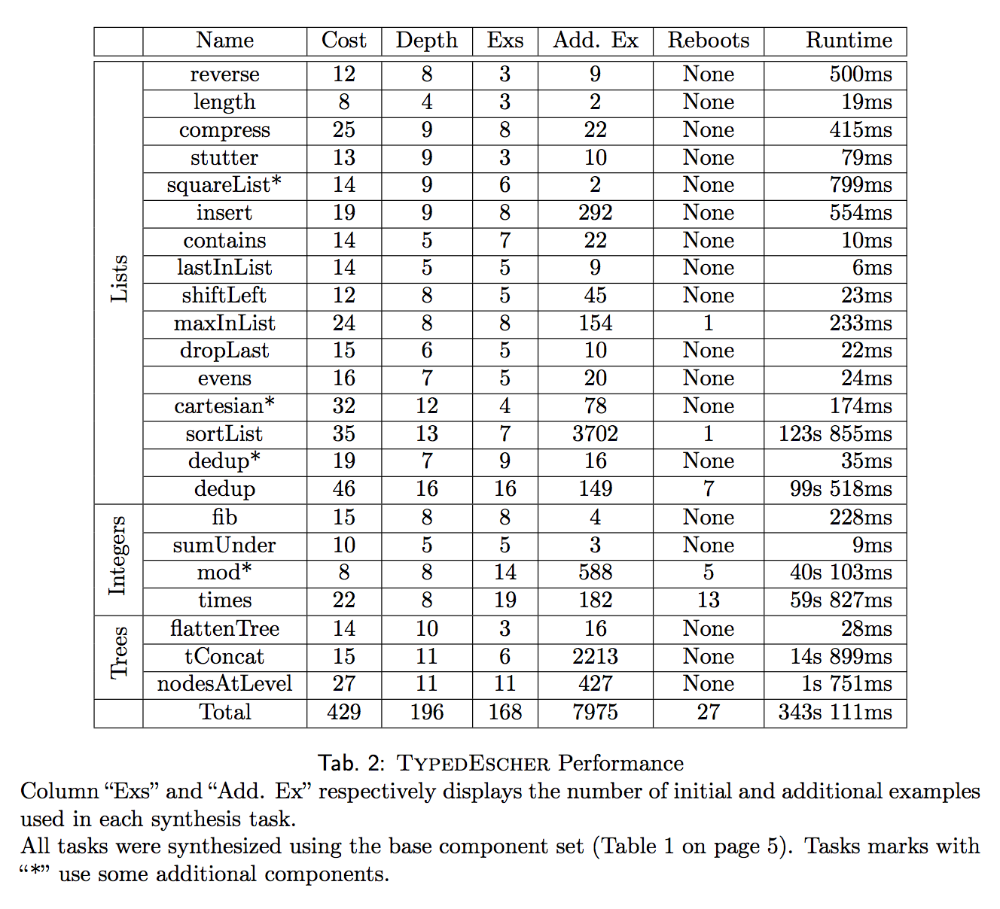
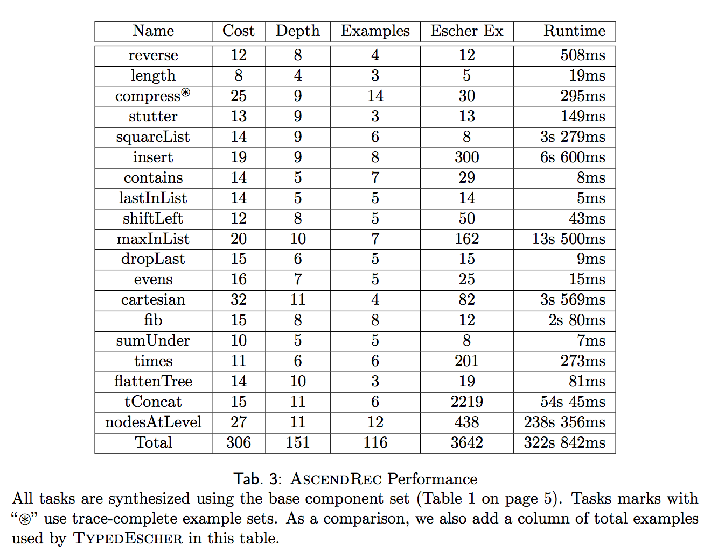
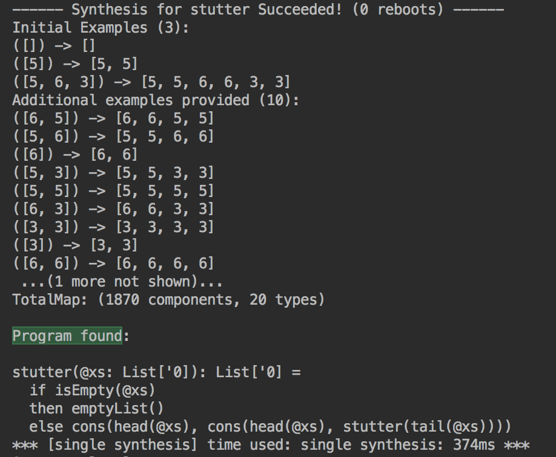
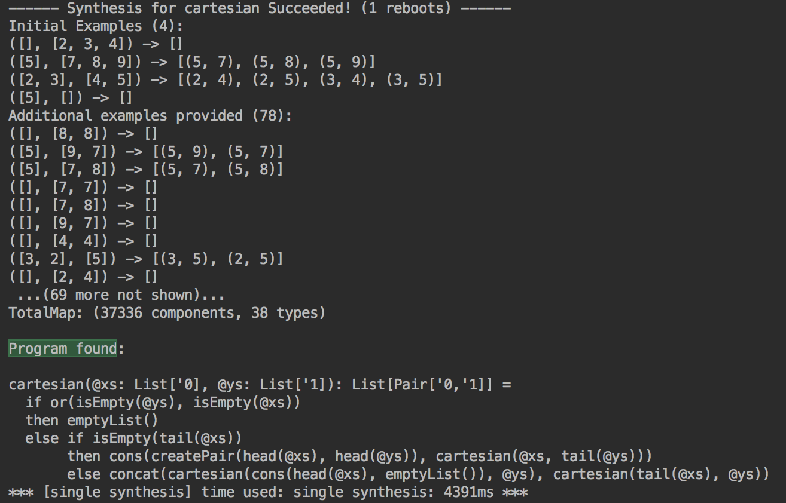
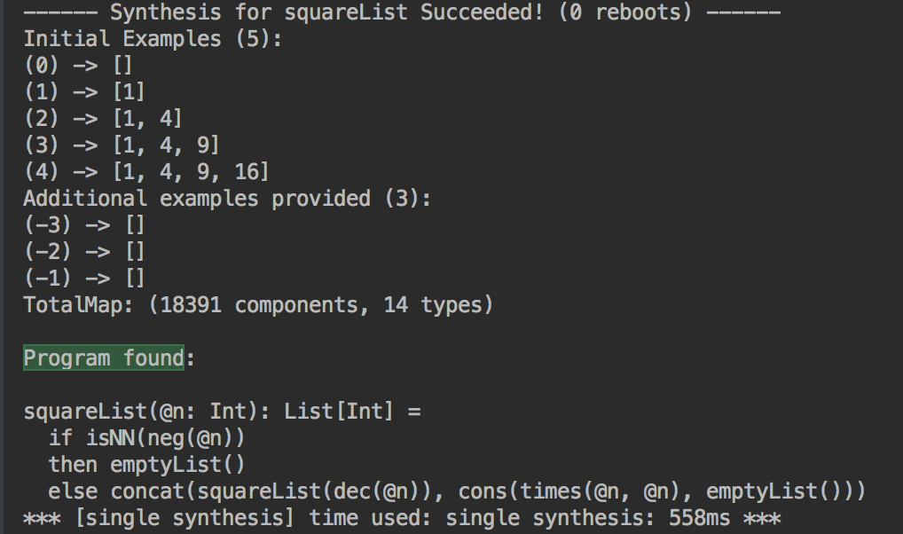
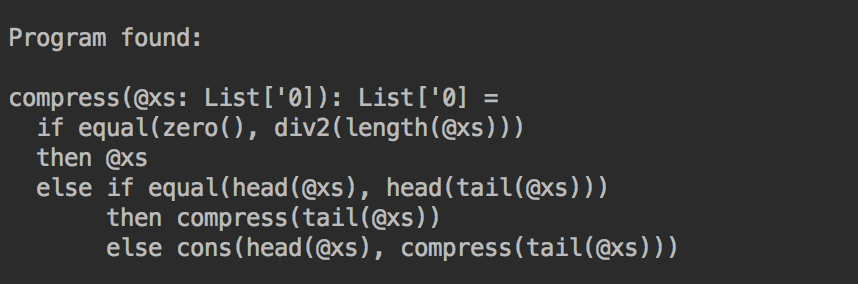
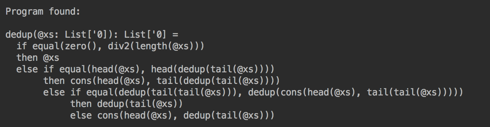

# Escher-Scala
Example-Driven Recursive Program Synthesis

This repository contains the source code of this thesis [Oracle-free Synthesis of Recursive Programs](documentation/AscendRec-en.pdf).

The codebase implements two algorithms: **TypedEscher** and **AscendRec**

**TypedEscher** is a Scala implementation of the *Escher* algorithm, described in this paper [Recursive Program Synthesis(CAV'13)](https://www.microsoft.com/en-us/research/publication/recursive-program-synthesis/), with the addition of a polymorphic static type system and other type-related optimizations to improve searching efficiency.

**AscendRec** is a new algorithm based on *TypedEscher*, but unlike *TypedEscher*, which requires the user to provide additional input-output examples during synthesis, *AscendRec* dose not need any additional examples to work.

 

### Results taken from the [thesis](documentation/AscendRec-en.pdf).

 

 

### Some Synthesized Programs(TypedEscher):

- Duplicate each element of a list

- Cartesian product of two lists

- Square of naturals

- Remove adjacent duplicates in a list

- Remove all duplicates in a list (synthesized without using additional components)

See full output log in [result_TypedEscher.txt](documentation/text_results/result_TypedEscher.txt) and [result_AscendRec.txt](documentation/txt_results/result_AscendRec.txt)

