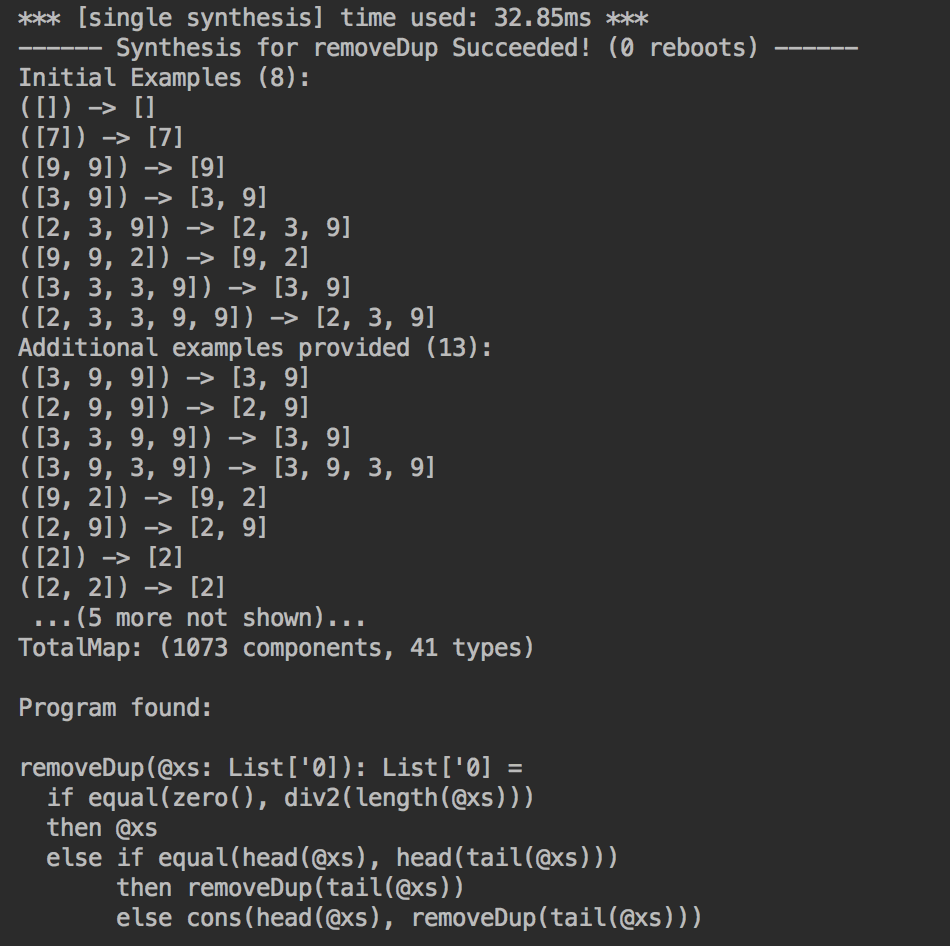
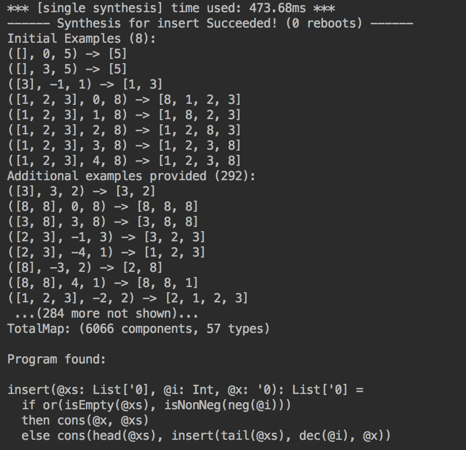

# Escher-Scala
Recursive Program Synthesis

A Scala implementation of the algorithm described in this paper [Recursive Program Synthesis(CAV'13)](https://www.microsoft.com/en-us/research/publication/recursive-program-synthesis/), with the addition of a polymorphic static type system to improve searching efficiency.

**Currently working in progress**

Example Run:

 

- Stutter

- Cartesian product of two lists

- Square of naturals

- Remove adjacent duplicates

- Insert an element into a list

