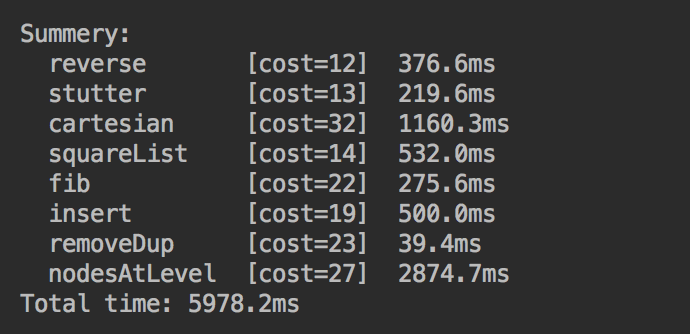
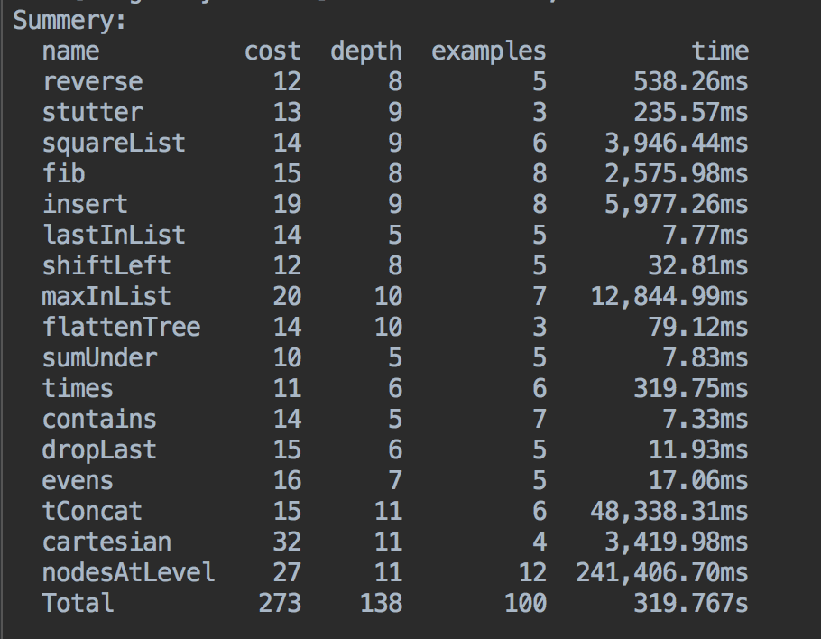

# Escher-Scala
Example-Driven Recursive Program Synthesis

This repository contains two algorithm: **TypedEscher** and **AscendRec**

**TypedEscher** is a Scala implementation of the algorithm described in this paper [Recursive Program Synthesis(CAV'13)](https://www.microsoft.com/en-us/research/publication/recursive-program-synthesis/), with the addition of a polymorphic static type system and other type-related optimizations to improve searching efficiency.

**AscendRec** is a new algorithm based on *TypedEscher*, but unlike *TypedEscher*, which requires the user to provide additional input-output examples during synthesis, *AscendRec* dose not need any additional examples to finish its work.

 

**Currently working in progress**

### Results (TypedEscher):

 

- Duplicate each element of a list

- Cartesian product of two lists

- Square of naturals

- Remove adjacent duplicates in a list

- Remove all duplicates in a list (synthesized without using additional components)

see also [result.txt](documentation/txt_results/result.txt)

### Results (AscendRec)

 

 see also [result_AscendRec.txt](documentation/txt_results/result_AscendRec.txt)